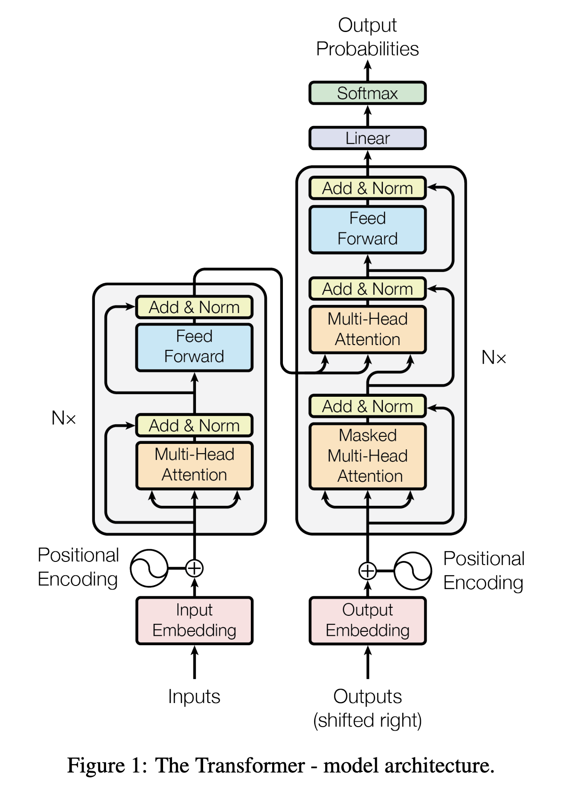

**Attention Is All You Need** 논문의 디코더 부분을 이해해보자.



Vaswani, Ashish, et al. "Attention is all you need." Advances in neural information processing systems 30 (2017).

Shakespeare의 글을 학습해 새로운 텍스트를 만들어볼 것이다.

먼저 데이터셋을 다운받고 셋팅을 한다.

```
!wget "https://raw.githubusercontent.com/Joocheol/Transformer/b96eaede3556f79a0948ef8dc666848380dc9e6e/input.txt"

import torch
import torch.nn as nn
from torch.nn import functional as F

# hyperparameters
batch_size = 32
block_size = 8
max_iters = 3000

learning_rate = 1e-3
device = "cuda" if torch.cuda.is_available() else "cpu"

n_emb = 32
```

이 때 `block_size` 는 다음 문자를 맞출 때 보는 단어의 사이즈이다.  
`n_emb`는 number of embedding 으로,  
내가 어떤 토큰을 몇 차원의 벡터를 볼 것인가이다.  
이 숫자가 커질수록 계산하는 데에 오래걸린다.

텍스트를 읽고 프린트해보자.

```python
with open("input.txt", "r", encoding="utf-8") as f:
    text = f.read()

print(text[:300])
```

먼저 문자를 다 숫자로 바꾸어야 한다.

`set`을 이용해서 토큰의 갯수를 파악하고 chars 로 만든다.

```
chars = sorted(list(set(text)))
vocab_size = len(chars)
```

각 문자와 숫자를 대응시키는 `stoi`, `itos` 를 만들고 이를 적용하는 람다함수를 만든다.

```python
stoi = {ch: i for i, ch in enumerate(chars)}
itos = {i: ch for i, ch in enumerate(chars)}
encode = lambda s: [stoi[c] for c in s]
decode = lambda x: "".join([itos[i] for i in x])
```

이렇게 encode 후 다시 decode 하면 원본 텍스트를 볼 수 있다.

```python
decode(encode(text[0:100]))
```

이제 텍스트를 다 인코딩시키고 텐서로 만들어서 data 로 만든다.

```python
data = torch.tensor(encode(text), dtype=torch.long)
n = int(0.9*len(data))
train_data = data[:n]
val_data = data[n:]
```

이 때 90% 의 데이터를 train data 로 설정하고 나머지를 validation data로 설정했다.

이 데이터를 batch 로 묶어주는 함수를 만든다.

```python
def get_batch(split):
    data = train_data if split == "train" else val_data
    ix = torch.randint(len(data)-block_size, (batch_size,))
    x = torch.stack([data[i:i+block_size] for i in ix])
    y = torch.stack([data[i+1:i+block_size+1] for i in ix])
    x, y = x.to(device), y.to(device)
    return x, y

xb, yb = get_batch('train')
```

train 인지 valid인지 인자로 받아서 해당하는 데이터를 넣을 수 있게 했다.

{: .note}
파이토치에서 사용할 데이터, 모델 등은 모두 같은 device에 올라가 있어야 한다.

우리가 하고싶은 것은 이렇게 character 을 보고 다음 character 을 맞추는 것이다.
