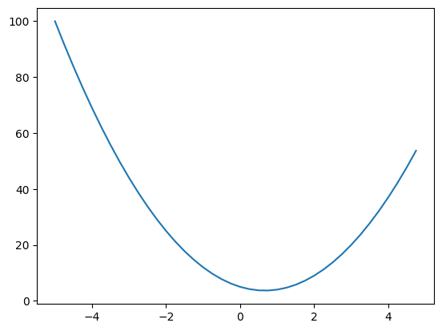
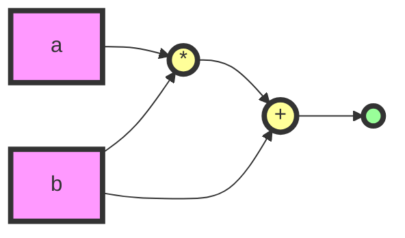
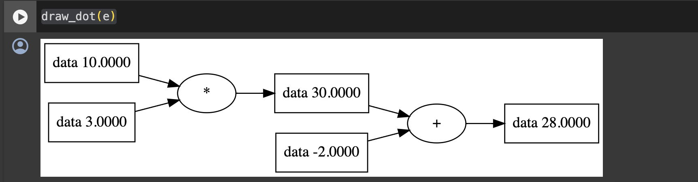
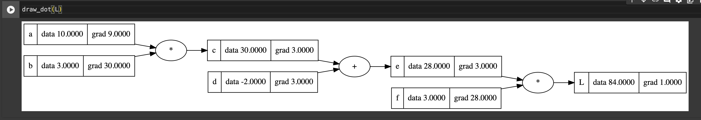

# Backpropagation 이해하기

Backpropagation은 무엇이고 python 코드로 어떻게 구현하는지 알아보자.

**Backpropagation이란**

Backpropagation은 loss를 최소화하기 위해 사용하는 알고리즘이다.  
chain rule을 적용하여 gradient를 계산하는 과정을 포함한다.

**Gradient란**

그래디언트는 쉽게 생각하면 우리가 아는 함수의 편미분을 모아놓은 것이다.  
이를 통해 loss function의 최소값을 효율적으로 찾아갈 수 있다.

### Python에서의 구현

**Intro**

우선 필요한 라이브러리를 임포트하고, 함수를 정의한다.

```python
import numpy as np
import matplotlib.pyplot as plt

def f(x):
return 3*x\*\*2 - 4*x + 5
```

np.arange를 사용하여 함수의 그래프를 그릴 수 있다.

```
python
Copy code
xs = np.arange(-5, 5, 0.25)
ys = f(xs)
plt.plot(xs, ys)
```



이 함수에 대해서 numerical하게 미분을 계산할 수도 있다.

```
h = 0.00001
(f(3.0+h) - f(3.0)) / h
```

**클래스 정의**

```python
class Value:
    def __init__(self, data):
        self.data = data

    def __repr__(self):
        return f"Value(data={self.data})"
```

먼저 새로운 클래스를 만들고 인스턴스를 생성해 보자.

```python
a = Value(10.0)
b = Value(3.0)
```

Value 클래스는 `__init__`을 통해 인스턴스를 초기화하고, `__repr__`을 통해 객체의 데이터를 표현한다.

**Add and multiply**

```python
class Value:
def __init__(self, data):
self.data = data

    def __repr__(self):
        return f"Value(data={self.data})"

    def __add__(self, other):
        out = Value(self.data + other.data)
        return out
```

**add** 메소드를 추가하여 두 Value 객체를 더할 수 있게 한다.

그러면 이제 당연히 이런 식으로 더할 수 있게 한다.

```python
a = Value(10.0)
b = Value(3.0)
a.__add__(b)
```

그런데, 다음과 같이 써도 에러가 나지 않고 우리가 추가한 메소드가 실행되는 걸 볼 수 있다.

```python
a = Value(10.0)
b = Value(3.0)
a + b
```

파이썬에서는 오브젝트에 `__add__` 가 있는지 찾는다.그래서 이렇게 해도 우리가 define 한 `__add__` 를 실행할 수 있다. (연산자 오버로딩)

`__mul__` 메소드를 추가하여 곱셈도 만들자.

```python
class Value:
    def __init__(self, data):
        self.data = data

    def __repr__(self):
        return f"Value(data={self.data})"

    def __add__(self, other):
        out = Value(self.data + other.data)
        return out

    def __mul__(self, other):
        out = Value(self.data * other.data)
        return out
```

이제 Value 객체끼리의 곱셈과 덧셈을 자유롭게 수행할 수 있다.

**그래프 형태로 표현하기**

만든 클래스를 가지고 뭘 할거냐면 이런 걸 할 것이다.



이렇게 시각화 하려면 어떤 operation 이고 어떤 항목이 적용되었는지 알아야 한다.

**클래스 재정의**

```python
class Value:
    def __init__(self, data, _children=(), _op=""):
        self.data = data
        self._prev = set(_children)
        self._op = _op

    def __repr__(self):
        return f"Value(data={self.data})"

    def __add__(self, other):
        out = Value(self.data + other.data, _children=(self, other), _op="+")
        return out

    def __mul__(self, other):
        out = Value(self.data * other.data, _children=(self, other), _op="*")
        return out
```

\_children, \_op 인자를 처음에 빈칸으로 정의해주고
연산할때, 연산한 밸류 오브젝트 자체의 \_children 과 \_op를 정해주자

```python
a = Value(10.0)
b = Value(3.0)
c = a * b
d = Value(-2.0)
e = c + d
```

previous 로 보면 children 을 볼 수 있다.

```python
c._prev
```

```python
b._prev
```

b 의 경우는 empty 이다.

```python
from graphviz import Digraph

def trace(root):
    nodes, edges = set(), set()
    def build(v):
        if v not in nodes:
            nodes.add(v)
            for child in v._prev:
                edges.add((child, v))
                build(child)
    build(root)
    return nodes, edges

def draw_dot(root, format='svg', rankdir='LR'):
    """
    format: png | svg | ...
    rankdir: TB (top to bottom graph) | LR (left to right)
    """
    assert rankdir in ['LR', 'TB']
    nodes, edges = trace(root)
    dot = Digraph(format=format, graph_attr={'rankdir': rankdir})

    for n in nodes:
        dot.node(name=str(id(n)), label = "{ data %.4f }" % (n.data,), shape='record')
        if n._op:
            dot.node(name=str(id(n)) + n._op, label=n._op)
            dot.edge(str(id(n)) + n._op, str(id(n)))

    for n1, n2 in edges:
        dot.edge(str(id(n1)), str(id(n2)) + n2._op)

    return dot
```

graphiz 를 사용해 그림을 그려볼 수 있다.

```python
a = Value(10.0)
b = Value(3.0)
c = a * b
d = Value(-2.0)
e = c + d

draw_dot(e)
```



### Gradient 계산

**클래스 재정의**

다시 클래스를 정의해보자. 각 노드의 그래디언트와 이름을 관리해서 gradient 를 계산하고 시각화해볼 것이다.

```python
class Value:
    def __init__(self, data, _children=(), _op="", name=""):
        self.data = data
        self.grad = 0.0
        self._prev = set(_children)
        self._op = _op
        self.name = name

    def __repr__(self):
        return f"Value(data={self.data})"

    def __add__(self, other):
        out = Value(self.data + other.data, _children=(self, other), _op="+")
        return out

    def __mul__(self, other):
        out = Value(self.data * other.data, _children=(self, other), _op="*")
        return out
```

이번에는 self.grad = 0.0 라는 부분이 추가된 것과
name 인자가 추가된 것을 볼 수 있다.
name 은 그림에서 편의상 노드를 구분해 보기 쉽게 추가한 것이다.

시각화하는 함수도 gradient 와 name 표시할 수 있도록 수정해주자.

```python
from graphviz import Digraph

def trace(root):
    nodes, edges = set(), set()
    def build(v):
        if v not in nodes:
            nodes.add(v)
            for child in v._prev:
                edges.add((child, v))
                build(child)
    build(root)
    return nodes, edges

def draw_dot(root, format='svg', rankdir='LR'):
    """
    format: png | svg | ...
    rankdir: TB (top to bottom graph) | LR (left to right)
    """
    assert rankdir in ['LR', 'TB']
    nodes, edges = trace(root)
    dot = Digraph(format=format, graph_attr={'rankdir': rankdir}) #, node_attr={'rankdir': 'TB'})

    for n in nodes:
        dot.node(name=str(id(n)), label = "{ %s | data %.4f | grad %.4f }" % (n.name, n.data, n.grad), shape='record')
        #dot.node(name=str(id(n)), label = "{ data %.4f }" % (n.data,), shape='record')
        if n._op:
            dot.node(name=str(id(n)) + n._op, label=n._op)
            dot.edge(str(id(n)) + n._op, str(id(n)))

    for n1, n2 in edges:
        dot.edge(str(id(n1)), str(id(n2)) + n2._op)

    return dot
```

아까보다 한 단계 더 복잡한 그래프를 만들어보자.

```python
a = Value(10.0, name="a")
b = Value(3.0, name="b")
c = a * b ; c.name = "c"
d = Value(-2.0, name="d")
e = c + d; e.name = "e"
f = Value(3.0, name='f')
L = e * f; L.name = "L"
```


