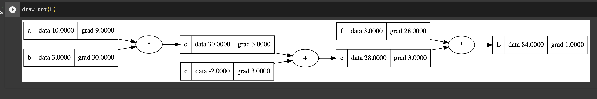
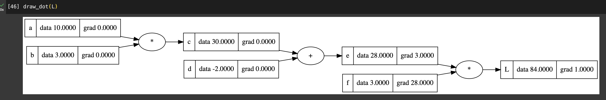
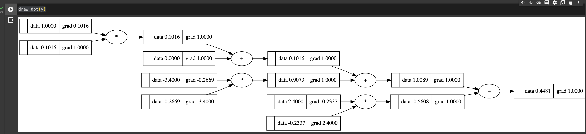

# Backpropagation 2/2

---

우리는 현재 어떻게 하면 L을 줄이 줄어드는 모양으로 학습할 수 있을까?를 탐험하고 있는 중이다.  
앞에있는 노드들을 어느 방향으로 얼만큼 변화켜야 할까?

## Manual하게 gradient 계산하기

코드를 살펴보면서 다음과 같이 미분을 직접 해보자..

$$
\lim_{h \to 0} \frac{f(x + h) - f(x)}{h}
$$

```python
def deriv():

    h = 0.001

    a = Value(10.0, name="a")
    b = Value(3.0, name="b")
    c = a * b ; c.name = "c"
    d = Value(-2.0, name="d")
    e = c + d; e.name = "e"
    f = Value(3.0, name='f')
    L = e * f; L.name = "L"
    L1 = L.data

    a = Value(10.0+h, name="a")
    b = Value(3.0, name="b")
    c = a * b ; c.name = "c"
    d = Value(-2.0, name="d")
    e = c + d; e.name = "e"
    f = Value(3.0, name='f')
    L = e * f; L.name = "L"
    L2 = L.data

    print((L2-L1)/h)

deriv()
```

코드를 실행하면 9.000000000000341 이라는 숫자가 나온다.  
즉 A의 값을 0.001 만큼 증가시키면 마지막 loss 의 값이 증가한다는 것이다.

L을 L에대해서 편미분하면 1.0 이고,

$$
L = e \cdot f
$$

이므로 편미분하면 다음과 같다.

$$
\frac{\partial L}{\partial e} = f , \quad \frac{\partial L}{\partial f} = e
$$

이를 직접 확인해보기 위해
이번에는 deriv()함수에서 e에 h를 더하는 형태로 바꿔보자.

```python
def deriv():

    h = 0.001

    a = Value(10.0, name="a")
    b = Value(3.0, name="b")
    c = a * b ; c.name = "c"
    d = Value(-2.0, name="d")
    e = c + d; e.name = "e"
    f = Value(3.0, name='f')
    L = e * f; L.name = "L"
    L1 = L.data

    a = Value(10.0, name="a")
    b = Value(3.0, name="b")
    c = a * b ; c.name = "c"
    d = Value(-2.0, name="d")
    e = c + d; e.name = "e"
    e.data = e.data + h
    f = Value(3.0, name='f')
    L = e * f; L.name = "L"
    L2 = L.data

    print((L2-L1)/h)

deriv()
```

결과로 3.0000000000001137 이 나오는 것을 볼 수 있다.
L을 e에대해서 미분하면 f 가 나오는데, f 의 데이터값이 3인..

같은 방법으로 이번에는 f 에 더해서 확인해보자.

```python
f = Value(3.0+h, name='f')
```

그러면 deriv()의 결과가 e 의 데이터값과 같은 27.999999999991587 이 나오는 것을 볼 수 있다.

이제 l e 와 f 의 그라디언트를 계산했으니 그래프에서 볼 수 있도록 반영해주자. 지금은 manual 하게 바꿔주지만 차후에 자동으로 적용할 수 있도록 바꿔줄 것이다.

```python
L.grad = 1.0
e.grad = 3.0
f.grad = 28.0
```

그러면 이보다 하나 앞인 노드들의 gradient 를 어떻게 알까?
c 를 얼마만큼 변화시키면 L 이 얼마만큼 변화하는지. d를 얼마만큼 변화시키면 L 이 얼마만큼 변화하는지 알고 싶은 것이다!

$$
L = e \cdot f
$$

$$ e = c + d $$

$$
\frac{\partial L}{\partial c} = \frac{\partial L}{\partial e} \cdot \frac{\partial e}{\partial c}
$$

그런데 이미 e 로 편미분한건 구했으니까 e를 c 에 대해 편미분한 거만 구하면 된다.

이제 deriv()함수에서 h 를 c 에만 추가하도록 바꿔주자.

```python
c.data = c.data + h
```

실행하면 3.0000000000001137 이 나온다. 직접 미분한 결과랑 같은 것을 알 수 있다.

d에 대해서도 마찬가지로 수행하면 역시 3임을 알 수 있다.

마지막으로 a 에 대해서 계산해보자.

$$ \frac{\partial L}{\partial a} = \frac{\partial L}{\partial c} \cdot \frac{\partial c}{\partial a} $$

L을 c에대해 편미분한 값은 이미 구해놨으므로 c를 a에 대해 편미분한 값만 구하면 된다.
즉 앞에서 계산한 거에다 앞 데이터에 대한 gradient 만 곱하면 되는 것이다.

b도 마찬가지이다.

앞선 방법으로 gradient 를 다 구해보면 다음과 같을 것이다.
지금은 manual 하게 설정해주고 그림을 보도록 하자.

```python
L.grad = 1.0
e.grad = 3.0
f.grad = 28.0
d.grad = 3.0
c.grad = 3.0
a.grad = 9.0
b.grad = 30.0
```



## 코드를 통해 자동으로 계산하기

손으로 계산했던 것을 코드로 해보자.

```python
class Value:
    def __init__(self, data, _children=(), _op="", name=""):
        self.data = data
        self.grad = 0.0
        self._prev = set(_children)
        self._backward = lambda: None
        self._op = _op
        self.name = name

    def __repr__(self):
        return f"Value(data={self.data})"

    def __add__(self, other):
        out = Value(self.data + other.data, _children=(self, other), _op="+")

        def _backward():
            # self.grad = 1.0 * out.grad
            # other.grad = 1.0 * out.grad
            self.grad += out.grad
            other.grad += out.grad
        out._backward = _backward

        return out

    def __mul__(self, other):
        out = Value(self.data * other.data, _children=(self, other), _op="*")

        def _backward():
            self.grad += other.data * out.grad
            other.grad += self.data * out.grad
        out._backward = _backward

        return out
```

self.\_\_backward 가 추가되고, add 와 muptiply 에 관련한 코드가 추가된 것을 볼 수 있다.

multiplication 만 뜯어서 살펴보면

```python
def __mul__(self, other):
        out = Value(self.data * other.data, _children=(self, other), _op="*")

        def _backward():
            self.grad += other.data * out.grad
            other.grad += self.data * out.grad
        out._backward = _backward

        return out
```

위에서 했던 계산과정 그대로 적혀있는 것을 알 수 있다.  
나의 앞에 있던 grdient 와 나의 반대쪽의 데이터를 곱해서 더해준다.

더하기의 경우 앞에 있던 gradient 들이 그대로 흘러들어오는 것을 볼 수 있다.

```python
def __add__(self, other):
        out = Value(self.data + other.data, _children=(self, other), _op="+")

        def _backward():
            # self.grad = 1.0 * out.grad
            # other.grad = 1.0 * out.grad
            self.grad += out.grad
            other.grad += out.grad
        out._backward = _backward

        return out
```

식을 생각해보면 당연하다는 것을 알 수 있다.
커맨드 처리한 것처럼 쓰면 될 것 같지만 저렇게 처리해주면 에러가 나는 경우가 있어서 +=로 처리해 준다고 한다.

$$
f(c, d) = c+d
$$

$$
\lim_{h \to \infty} \frac{f(c + h, d) - f(c, d)}{h} = \lim_{h \to \infty} \frac{(c + h + d) - (c + d)}{h} = \lim_{h \to \infty} \frac{h}{h} = \lim_{h \to \infty} 1
$$

이제 다시 initialize 해주고 그려보면 grad 가 전부 0일 것이다.

```python
a = Value(10.0, name="a")
b = Value(3.0, name="b")
c = a * b ; c.name = "c"
d = Value(-2.0, name="d")
e = c + d; e.name = "e"
f = Value(3.0, name='f')
L = e * f; L.name = "L"

draw_dot(L)
```

이제 L의 gradient 를 설정해주고 backward를 콜해보자.

```python
L.grad = 1.0\
L._backward()
```

그림을 다시 그려보면, e 와 f의 gradient 가 바뀐 것을 볼 수 있다!

```
draw_dot(L)
```



다음으로 f에대해서는 실행해도 그 전에 아무것도 없으므로 그림에 아무 변화도 일어나지 않는다.

```
L._backward()
```

다음으로 차차 gradient 계산을 하면 다 얻을 수 있는데,  
그렇게 하지 말고 더 발전시켜 보자.

### ordering

그래프를 순서대로 찾아나가는 알고리즘을 추가해주자.

```python
class Value:
    def __init__(self, data, _children=(), _op="", name=""):
        self.data = data
        self.grad = 0.0
        self._prev = set(_children)
        self._backward = lambda: None
        self._op = _op
        self.name = name

    def __repr__(self):
        return f"Value(data={self.data})"

    def __add__(self, other):
        out = Value(self.data + other.data, _children=(self, other), _op="+")

        def _backward():
            # self.grad = 1.0 * out.grad
            # other.grad = 1.0 * out.grad
            self.grad += out.grad
            other.grad += out.grad
        out._backward = _backward

        return out

    def __mul__(self, other):
        out = Value(self.data * other.data, _children=(self, other), _op="*")

        def _backward():
            self.grad += other.data * out.grad
            other.grad += self.data * out.grad
        out._backward = _backward

        return out

    def backward(self):

        # topological order all of the children in the graph
        topo = []
        visited = set()
        def build_topo(v):
            if v not in visited:
                visited.add(v)
                for child in v._prev:
                    build_topo(child)
                topo.append(v)
        build_topo(self)

        # go one variable at a time and apply the chain rule to get its gradient
        self.grad = 1
        for v in reversed(topo):
            v._backward()
```

`for v in reversed(topo)` 를 사용해 역순으로 찾아나가고 있다.

```python
a = Value(10.0, name="a")
b = Value(3.0, name="b")
c = a * b ; c.name = "c"
d = Value(-2.0, name="d")
e = c + d; e.name = "e"
```

그럼 이렇게만 계산해도 그래프에 그라디언트가 다 채워지는 것을 볼 수 있다!

```python
e.backward()
```

## Neural Network 만들기

우리가 만들었던 class 를 가지고 이제 간단한 neural network 를 만들 수 있다!

```python
class Neuron:

    def __init__(self, nin, nonlin=True):
        self.w = [Value(np.random.uniform(-1,1)) for _ in range(nin)]
        self.b = Value(0)
        self.nonlin = nonlin

    def __call__(self, x):
        act = sum((wi*xi for wi,xi in zip(self.w, x)), self.b)
        return act.relu() if self.nonlin else act

x = [Value(1.0), Value(-3.4), Value(2.4)]
y = Neuron(3, nonlin=False)(x)
```

복잡한 신경망이지만,  
`backward()`를 통해 gradient 를 자동으로 계산해 낸 것을 그려볼 수 있다!

```python
y.backward()

draw_dot(y)
```


