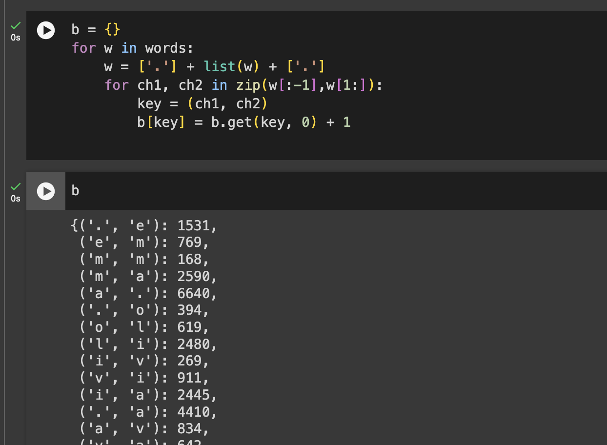

# Bigram - Counting

---

## Bigram 이란?

간단하게 말하면 두개씩만 보는 모형이다.

예를 들어 "emma" 라는 단어가 있으면,  
e를 보면 두번재 m 을 보고, 두번째 m 을 보면 세번째 m을 보고 이렇게 pair 로 보는 것이다.


나중에 word level 로도 확장시킬 수 있지만 일단 character level에서부터 보도록 하자.

## Code

데이터셋은 [여기]({{"https://raw.githubusercontent.com/Joocheol/micrograd/master/names.txt"}}/) 에서 다운받을 수 있다.

파일을 읽어보자.

```
words = open('names.txt', 'r').read().splitlines()
```

원본파일이 line by line 으로 작성되어 있기 때문에 읽으면서 `.read().splitlines()`로 분리해주었다.

```
words[:5]
```


words 에 이름들이 잘 담겼다.

연속되어있는 character pair 들을 카운트해보자.

```python
b = {}
for w in words[:20]:
    for ch1, ch2 in zip(w[:-1],w[1:]):
        key = (ch1, ch2)
        b[key] = b.get(key, 0) + 1
```

파이썬 딕셔너리의 경우 값이 없느면 None 을 돌려주는데,  
`.get(key, 0)` 같이 써서 0을 돌려주도록 할 수 있다.


그런데 이렇게 하면 문제가 있다.  
이름이 끝나서 바뀌는 부분을 고려하고 있지 않기 때문이다.

이를 해결하기 위해 시작과 끝에 각각 점을 붙여준다.

```
b = {}
for w in words:
    w = ['.'] + list(w) + ['.']
    for ch1, ch2 in zip(w[:-1],w[1:]):
        key = (ch1, ch2)
        b[key] = b.get(key, 0) + 1

```



어떤 조합이 가장 많이 나타났는 지 순서대로 보기 위해 정렬해보자.

```python
sorted(b.items(), key=lambda item: item[1], reverse=True)
```

정렬하는 대상인 key를 딕셔너리의 밸류로 지정해준다.

## 모델 만들기

파이토치를 임포트해 텐서를 만든다.

우리가 만든 pair를 matrix 형태로 저장하기 위해서  
영어의 알파벳 크기와 . 1개를 더한 27 로 행렬을 만들어준다.

```python
import torch

N = torch.zeros((27,27), dtype=torch.int32)
```

words 를 활용해 알파벳과 . 의 sorted list 를 만든다.

```python
chars = sorted(list(set(''.join(words))))
chars.insert(0,'.')
chars
```

character 을 enumerate 하면서 각 캐릭터와 숫자를 대응해준다.

```
stoi = {s: i for i,s in enumerate(chars)}
itos = {i: s for i,s in enumerate(chars)}
```


이를 활용하여 아까 만들어준 텐서 매트릭스에 character pair 조합이 몇 번 나왔는지 카운트를 해준다.

```python
for w in words:
    w = ['.'] + list(w) + ['.']
    for ch1, ch2 in zip(w[:-1],w[1:]):
        id1 = stoi[ch1]
        id2 = stoi[ch2]
        N[id1,id2] += 1

N
```

그림을 그려서도 이 결과를 확인할 수 있다.

```
import matplotlib.pyplot as plt
%matplotlib inline

plt.figure(figsize=(16,16))
plt.imshow(N, cmap='Blues')
for i in range(27):
    for j in range(27):
        chstr = itos[i] + itos[j]
        plt.text(j, i, chstr, ha="center", va="bottom", color='gray')
        plt.text(j, i, N[i, j].item(), ha="center", va="top", color='gray')
plt.axis('off');
```


아까 설정한대로 row 는 시작한 문자 기준, column 은 끝난 문자 기준이다.
