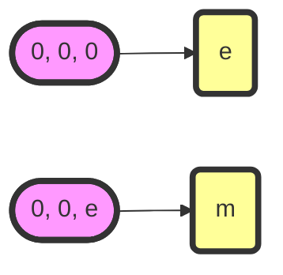
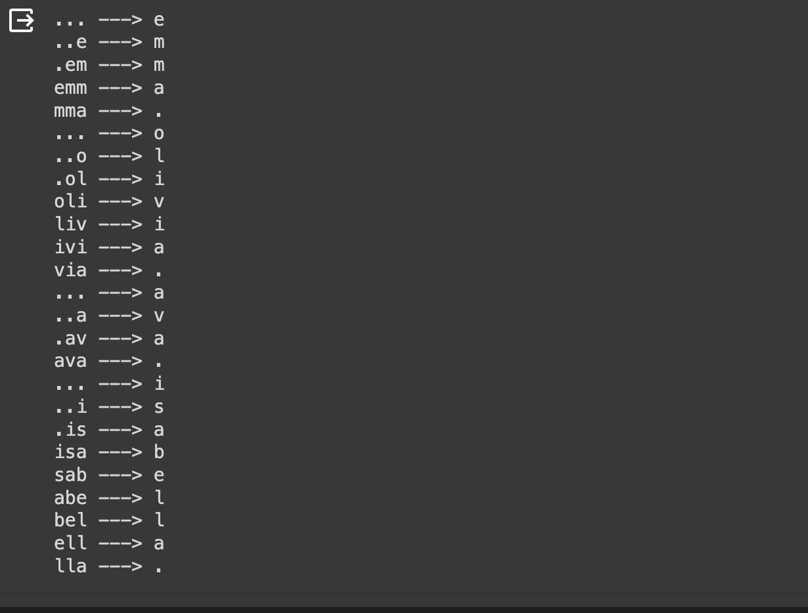

**A Neural Probabilistic Language Model** 의 논문을 직접 구현해보자.

지난번에는 앞의 한 글자씩만 봤는데, 이번에는 앞의 여러 글자를 보게 된다.



## Data Prepration

```
import numpy as np
import matplotlib.pyplot as plt

import torch
```

이번에는 인터넷에서 데이터를 가져와보자.

```python
!wget https://raw.githubusercontent.com/Joocheol/micrograd/master/names.txt
```

앞서 그림과 같은 context 라는 친구를 만들어볼 것이다.

```python
context_size = 3
X, Y = [], []

for w in words[:4]:
    context = [0] * context_size
    for ch in w + ".":
        ix = stoi[ch]
        X.append(context)
        Y.append(ix)

        print("".join(itos[i] for i in context), "--->", itos[ix])
        context = context[1:] + [ix]

X = torch.tensor(X)
Y = torch.tensor(Y)
```


