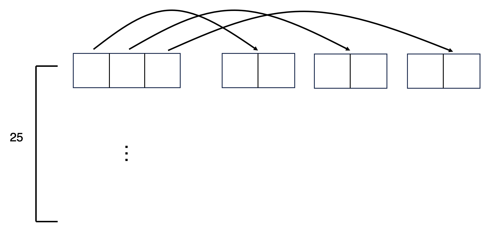

이번에는 **Table look-up in C** 부분을 구현해볼 것이다.

C는 워드 임베딩이다.

이 때 원 핫 인코딩을 하게 되면 단어의 사이즈만큼 어레이를 가지고 움직여야 한다.

또한 모든 원 핫 인코딩 벡터는 perpendicular 하다.

먼저 랜덤넘버로 임베딩 테이블을 만들 수 있다.

```python
C = torch.randn([27, 2])
```

예를 들어 `C[5]` 는 E에 대한 임베딩 값이다.

하나의 새로운 linear layer 라고도 해석할 수 있다.

```python
C[X]
C[X].shape # (25, 3, 2)
```

`C[X]`의 shape를 살펴보면 (25, 3, 2)인데 이렇게 볼 수 있다.



각각의 컨텍스트 안에 2차원의 임베딩이 correspond 하는 것이다.

```python
emb = C[X]
```
