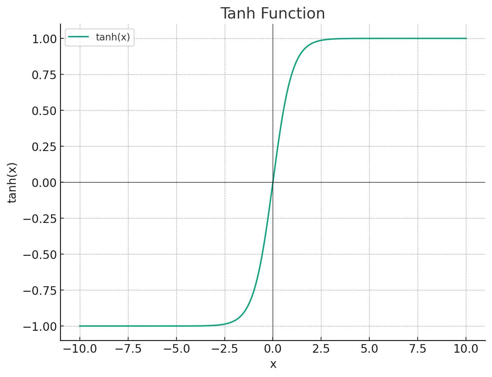

이번에는 **hidden layer** 이다.

논문에서는 tanh 를 쓰고 있다.



따라서 tanh(w \* x + b) 를 구현해볼 것이다.

```python
W1 = torch.randn([6, 100])
b1 = torch.randn([100])
```

노드를 100개로 만든 것은 hyperparameter 로 선택한 것이다.

우리가 하고싶은 것은 `emb @ W1 + b1`이기 때문에 emb 사이즈를 reshape 해준다.

```python
(emb.view(25, 6) @ W1 + b1).shape
```

tanh를 씌워준다.

```python
h = torch.tanh((emb.view(25, 6) @ W1 + b1))
```
