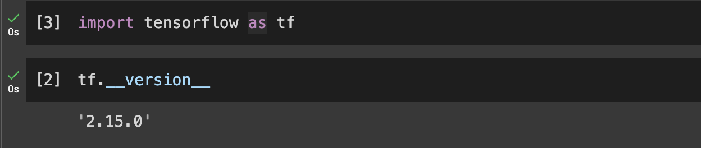
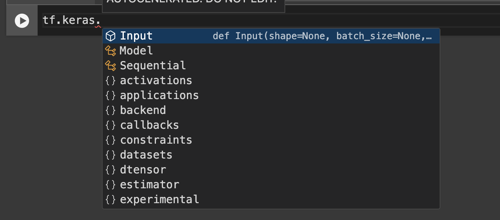
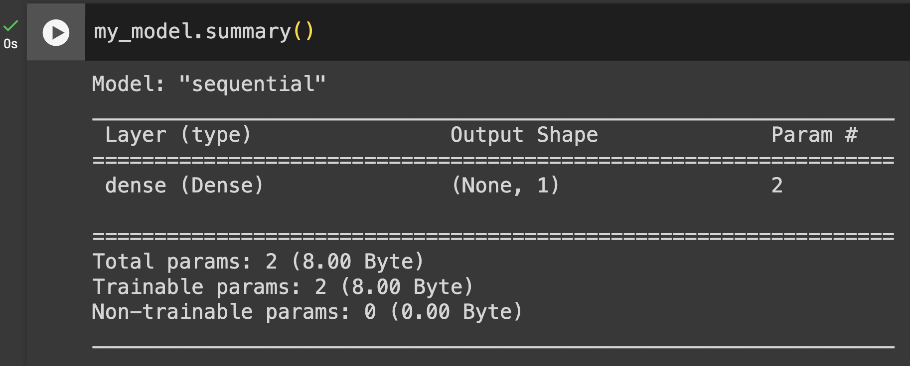
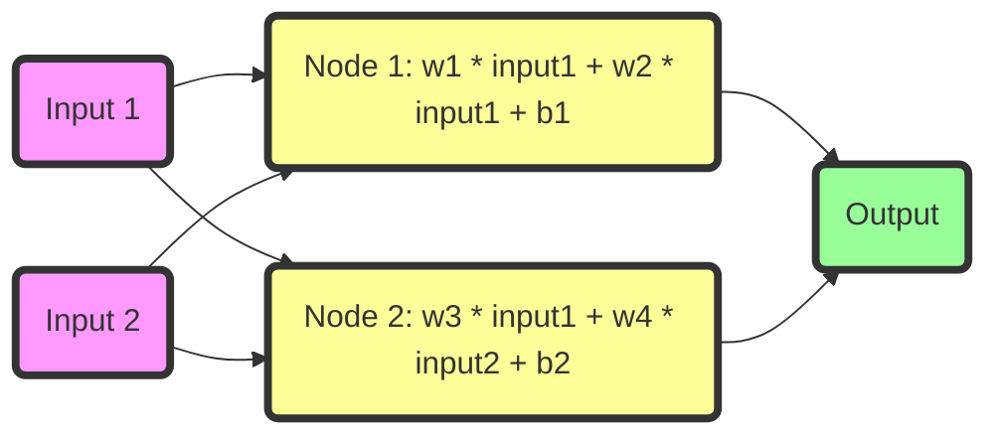

# Neural network 와 인사하기

---

여기 단 5개의 line 으로 신경망을 만드는 코드가 있다.

```python
import tensorflow as tf

my_model = tf.keras.Sequential([
    tf.keras.layers.Dense(1, input_shape=[1])
])

my_model.compile(
    loss = 'mse',
    optimizer = 'adam'
)

my_model.fit([0], [1])

my_model.predict([0.5])
```

코드를 한 줄씩 뜯어보도록 하자!  
Google colab 을 통해 손쉽게 line by line 으로 실행할 수 있다.

---

### 1. tensorflow 임포트 하기

**텐서플로우 임포트**

```python
import tensorflow as tf
```

**버전 확인**

```python
tf.__version__
```

{: .note }
코랩에서 경우 앞에 생기는 번호는 실행된 순서이다.  
만약 첫번째 셀 실행 후 두번째 셀을 실행한 다음, 다시 첫번째 셀을 실행하면  
다음처럼 될 것이다.


{: .note }
입력 중 탭키를 누르면 접근할 수 있는 method 나 variable을 볼 수 있다.


---

### 2. Basic tensorflow model 만들기

**sequential 모델 만들기**

```python
my_model = tf.keras.Sequential([
    tf.keras.layers.Dense(1, input_shape=[1])
])
```

한 개의 Dense 레이어를 가지고 Sequential 모델을 만들었다.  
크게 Sequential 모델과 functional 모델로 만들 수 있는데, 지금은 Sequential 로 만들어 보겠다.

sequential 안에는 하나의 레이어만 넣을 수 있는데,  
레이어를 여러개 만들 때에는 리스트로 넣으면 된다.
를
만든 모델의 정보를 다음과 같이 볼 수 있다.

```python
my_model.summary()
```



모델을 다시 만들고 summary를 다시 실행시키면 이름이 sequential_1과 dense_1로 바뀌는데,  
텐서플로우는 모델을 만들 때마다 이렇게 새로 붙여준다. 크게 신경 쓸 필요 없다.

위와 같이 레이어를 만들면 하나의 레이어 안에 노드가 하나만 있는 것이다.
또한 인풋이 어떤 모양인지 알아야되는데, `input_shape=[1]`으로 알려준 것이다.

아웃풋은 레이어와 노드가 하나기 때문에 지금은 한 개의 아웃풀을 갖게 된다.

아래처럼 하면 아웃풋이 10이 된다.

```python
my_model = tf.keras.sequential([
    tf.keras.layers.Dense(10, input_shape=[1])
])

my_model.summary()
```

**파라미터 갯수와 인풋쉐입 갯수의 관계**
w는 가중치, b 는 bias라고 하자. 이를 모델의 파라미터라고 한다.
노드와 인풋이 파라미터와 어떤 관계가 있는지 살펴보자.

먼저 전체적인 그림은 다음과 같이 표현할 수 있다.



그림을 이해해보기 위해 몇 가지 예시를 가지고 살펴보자.

첫 번째 모델을 살펴보자.

```python
my_model = tf.keras.Sequential([
    tf.keras.layers.Dense(2, input_shape=[1])
])
```

이 모델에서는 노드가 2개이며, 파라미터 개수는 4개다.  
각 노드에 대한 가중치 2개와 bias 2개가 포함되어 있기 때문이다.

이어지는 모델을 보자.

```python
my_model = tf.keras.Sequential([
tf.keras.layers.Dense(200, input_shape=[1])
])
```

이 모델의 파라미터 개수는 400개이다.
인풋이 한 개 이므로 역시 노드 하나당 두 개의 파라미터가 필요하기 때문이다.

다음 모델을 보자.

```python
my_model = tf.keras.Sequential([
tf.keras.layers.Dense(1, input_shape=[2])
])
```

인풋 두개가 노드 한 개에 들어가야 하므로 weight 가 두 개가 되고,
노드가 하나에 2개이므로 파라미터 갯수가 3개이다.

### 3. Loss and optimizer

레이어로 만든 아웃풋과 실제 우리가 만든 게 얼마나 가까운지 측정할 수 있는 방법은 'loss'을 통해서이다.

loss를 최소화하는 방향으로 모델을 최적화하는 것이 중요하다.
이 때 어떤 방법으로 오차를 줄일것인가를 optimizer 가 결정한다.

```python
my_model.compile(
    loss = 'mse',
    optimizer = 'adam'
)
```

### 4. 모델 학습

실제 데이터를 사용하여 모델을 학습시키는 line 이다.

```python

my_model.fit([0], [1], epochs=100, verbose=False)

```

epoch 의 default 값은 1 인데, 위처럼 설정할 수 있다.

verbose=False로 하면 모델을 학습할 때 계속 뜨는 로그들이 뜨지 않도록 할 수 있다.

### 5. 모델 예측

모델을 사용하여 값을 예측해보자.

```python
my_model.predict([0.5])
```

{: .highlight }
코드를 실행했을 때 본 글의 결과와 예측 결과가 다를 수 있다는 점을 유의하자. 이는 초기 가중치(w)와 편향(b)가 다르기 때문이다.

### 6.TIPS

- 활성화 함수를 모델에 추가할 수 있다. 또한 가중치와 편향을 직접 설정할 수도 있다:

```python
my_model = tf.keras.Sequential([
tf.keras.layers.Dense(1, input_shape=[1], activation='relu'),
tf.keras.layers.Dense(1)
])
```

- Dense Layer어는 위에 있는 모든 노드로부터 입력을 받는다.
- kernel_initialization 을 통해 w, b 를 따로 설정해줄 수 있다.
- `my_model.get_weights()`를 통해 w 와 b를 확인할 수 있다.
