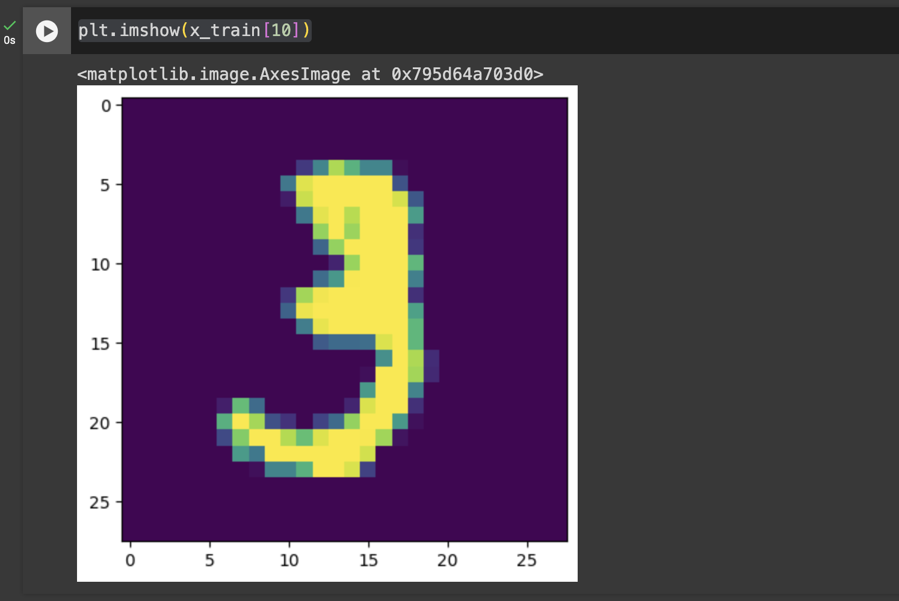
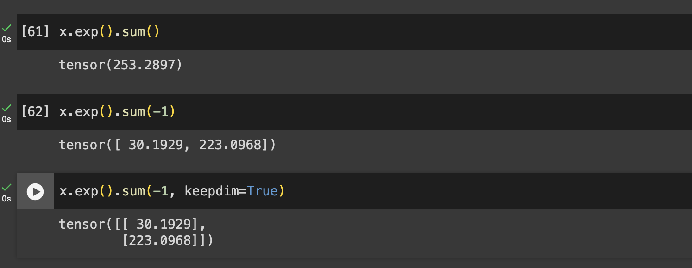
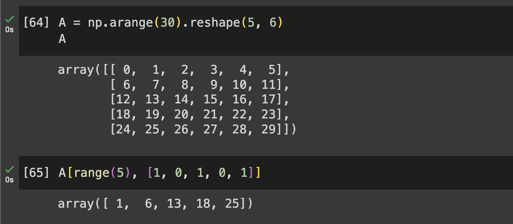

# What is torch.nn really? 1/3

---

파이토치 튜토리얼 [What is torch.nn really?]({{"https://pytorch.org/tutorials/beginner/nn_tutorial.html"}}/) 를 처음 진행하면 어렵게 느껴질 수 있다.
더욱 자세히 살펴보도록 하자.

## Dataset

tensorflow 를 활용해서 데이터를 좀 더 쉽게 불러와보자.

```
import tensorflow as tf

(x_train, y_train), (x_test, y_test) = tf.keras.datasets.mnist.load_data()
```

train, test 데이터와 x, y 데이터로 조합하며 데이터를 불러올 수 있다.

시각화해서 어떤 데이터가 들어있는지 볼 수 있다.

```
plt.imshow(x_train[10])
```



## Preprocess

```
x_train = torch.tensor(x_train.reshape(60000, 784)/255, dtype=torch.float32)
```

데이터가 60000개가 있는 것이고, 28\*28의 픽셀을 한 줄로 만들기 위해  
`x_train.reshape(60000, 784)` 을 한다.

색깔을 나타내는 0-255의 숫자를 255 로 나눠서 0-1 사이의 숫자로 만들어주자.
x_test 에 대해서도 마찬가지로 해주자.

```python
x_train = torch.tensor(x_train.reshape(60000, 784)/255, dtype=torch.float32)
x_test = torch.tensor(x_test.reshape(10000, 784)/255, dtype=torch.float32)

y_train = torch.tensor(y_train, dtype=torch.long)
y_test = torch.tensor(y_test, dtype=torch.int64)
```

**Regression**

regression 이라고 생각하고 이해해보면 쉽다.

```python
w = torch.randn((784, 10))
b = torch.randn((10, ))

x_train @ w + b
```

(60000, 784) @ (784, 10) -> (60000, 10)

{: .note }
broadcasting rule 에 의해 10이 (60000, 10) 로 됨을 유의하자.

이 10개의 아웃풋이 각각 0이 될 확률이 얼마인지, 1이될 확률이 얼마인지..로 만들어내고 싶은 것!

## Neural Network from scratch

```python
weights = torch.randn((784,10))
weights.requires_grad_()
bias = torch.zeros((10,), requires_grad=True)
```

bias를 보면 torch 에서 그래디언트를 계산하라고 정의하는 일반적인 방법을 볼 수 있다.  
weights 의 경우 randn 에는 이러한 인자가 존재하지 않기 때문에 `weights.requires_grad_()`와 같은 방법을 사용하였다.

이렇게 알려주지 않으면 `backward()`를 실행할 수 없다.
즉 아래와 같이 코드를 실행하면 에러가 난다.

```python
a = torch.tensor([3.14, 2.71])
b = torch.tensor([2.0, 10.0])
c = a*b
d = c.sum()

d.backward()
```

하지만 이렇게 하면 에러가 발생하지 않고 잘 실행된다.

```python
a = torch.tensor([3.14, 2.71]).requires_grad_()
b = torch.tensor([2.0, 10.0], requires_grad=True)
c = a*b
d = c.sum()

d.backward()
```

값이 왜 이렇게 나오는지는 [Backpropagation] 시리즈 를 보자.

### 모델 만들기

첫번째 모델을 만들어보자.

```
def model_0(inputs):
    outputs = inputs @ weights + bias
    return outputs
```

우선 여기에 바로 x_train 을 집어넣어보자..

```
prob = model_0(x_train)
prob
```

결과를 출력해보면 우리가 원하는 확률인 0~1 인 값이 아니다.  
softmax 를 가지곤 이를 해결할 수 있다.

[a, b, c]에 softmax 를 취하면 다음처럼 된다.

$$
 \left[ \frac{e^a}{e^a + e^b + e^c}, \frac{e^b}{e^a + e^b + e^c}, \frac{e^c}{e^a + e^b + e^c} \right]
$$

log-softmax 식은 다음과 같다.

$$
\text{log\_softmax}(x_i) = x_i - \log\left(\sum_{j=1}^n e^{x_j}\right)
$$

```python
def log_softmax(x):
    return x - x.exp().sum(-1, keepdim=True).log()
```

왜 이렇게 코드를 작성해야할까?
예를 들어 생각해보자.

```python
x = torch.tensor([[1, 2, 3], [3, 4, 5]], dtype=torch.float32)
x
```



-1을 인자로 넣어줌으로써 마지막 axis 를 기준으로 sum을 하고,  
keepdim=True를 통해 sum 된 dimension을 줄이지 않고 남겨놓는 것이다.

원본 토치 튜토리얼에는 다음과 같이 나와있다.

```python
def log_softmax(x):
    return x - x.exp().sum(-1).log().unsqueeze(-1)
```

`unsqueeze()`를 통해 dimsnsion을 만들어주는 것이다.

이를 사용해서 다시 모델을 만들어 보자.

```python
def model_1(inputs):
    outputs = inputs @ weights + bias
    return log_softmax(outputs)
```

## Log-likelihood

negative likelihood 인 nll을 정의해보자.

```python
def nll(prob, target):
    return -prob[range(target.shape[0]), target].mean()
```

negative likelihood 를 minimize 하는 값을 찾는다.
(즉 likelihood 를 maximize 하는)

return 부분을 이해하기 위해서 다음을 살펴보자.

**Numpy indexing**

예시로 A matrix 를 만들어서 살펴보다.

두번째 인자의 indexing 이 각각 row 마다 이루어지고 있는 것을 볼 수 있다.

`nll()`에서 target 이 y_train 이라고 했을 때  
target(답지)에 1에 가까운 확률이 들어있을수록 likelihood 가 높아지는 것이다.

## Loss function

방금 전 정의한 nll 로 loss function 을 정의하자.

```python
loss_func = nil
loss_func(prob, y_train)
```

얼마나 맞추는지 보기 위해서 accuracy 함수도 define 하자.

```python
def accuracy(prob, target):
    pred = torch.argmax(prob, dim=-1)
    return (pred == target).float().mean()
```

`argmax()`는 `prob` 의 가장 큰 값의 인덱스를 return 한다.

[Backpropagation]: backpropagation-1
