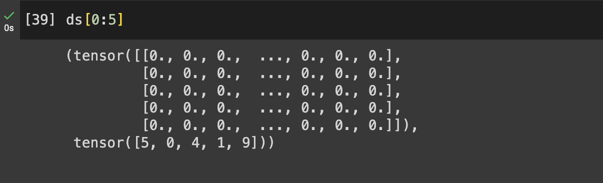
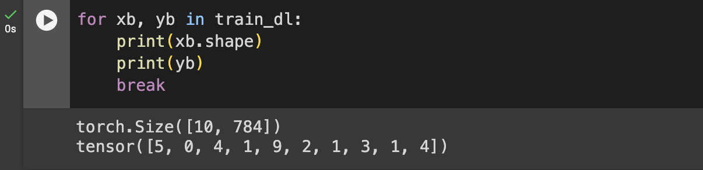

# What is torch.nn really? 3/3

---

## Refactor using Dataset

먼저 파이토치 튜토리얼에 있는 방식을 살펴보자.

```python
from torch.utils.data import TensorDataset

train_ds = TensorDataset(x_train, y_train)
```

`TensorDataset`을 이용한다.  
이 방식의 좋은 점은 다음 학습 코드를 보자.

```
model = MyModel()
optimizer = optim.Adam(params=model.parameters(), lr=lr)

batch_size = 128

lr = 0.01
epochs = 1000

for epoch in range(epochs):
    idx = torch.randint(len(x_train), (batch_size,))
    xs, ys = train_ds[idx]

    pred = model(xs)
    loss = loss_func(pred, ys)

    loss.backward()
    optimizer.step()
    optimizer.zero_grad()

print(loss_func(model(xs), ys))
```

`xs, ys = train_ds[idx]` 이런 식으로 x와 y를 한번에 할당해줄 수 있다.

이번에는 두번째 방식을 살펴보자.

위에서는 `TensorDataset` 을 사용했는데,  
일반적으로는 `Dataset` 을 많이 사용한다.

우선 텐서플로우를 통해 데이터를 가져오고 전처리하자.

```python
(x_train, y_train), (x_test, y_test) = tf.keras.datasets.mnist.load_data()

x_train = torch.tensor(x_train.reshape(60000, 784)/255, dtype=torch.float32)
x_test = torch.tensor(x_test.reshape(10000, 784)/255, dtype=torch.float32)

y_train = torch.tensor(y_train, dtype=torch.long)
y_test = torch.tensor(y_test, dtype=torch.int64)
```

`Dataset` 은 내가 원하는 형태로 shuffle 하고 batch 단위로 묶어주는 등의 역할을 한다.

```python
class MyDataset(torch.utils.data.Dataset):
    def __init__(self, data):
        self.data = data

    def __getitem__(self, idx):
        x = self.data[0][idx] ## 데이터 튜플의 0번
        y = self.data[1][idx] ## 데이터 튜플의 1번

        return x, y

    def __len__(self):
        return len(self.data[0]) # train x 를 뽑아서 크기를 측정

```

initialize 해보자.

```python
ds = MyDataset((x_train, y_train))
```

위에서 정의한 것과 상응하도록 data에 튜플로 묶어서 주도록 한다.
데이터를 확인해보자.

```
ds[0:5]
```

5개의 데이터를 뽑아서 출력한다.
각각 784개의 숫자와 함께 상응하는 레이블이 들어있는 것을 볼 수 있다.



## Refactor using DataLoader

데이터로더를 사용해보자.

```python
from torch.utils.data import DataLoader

# batch_size = 3

train_ds = MyDataset((x_train, y_train))
train_dl = DataLoader(train_ds, batch_size=10)
```

위에서 만든 데이터셋을 데이터로더에 집어넣고 있다.

데이터를 프로세스할때 직접 하나하나 돌리는 게 아니라 batch 단위로 돌리게 되는데 그일을 dataloader가 해준다.

데이터 로더 안에 뭐가 들어있는지 살펴보자.

```python
for xb, yb in train_dl:
    print(xb.shape)
    print(yb)
    break
```



배치사이즈인 10 으로 묶여있는 것을 확인할 수 있다.

이제 데이터 로더를 가지고 학습을 시켜보자.

```
model = MyModel()
optimizer = optim.Adam(params=model.parameters(), lr=lr)

for epoch in range(1):
    for xb, yb in train_dl:
        pred = model(xb)
        loss = loss_func(pred, yb)

        loss.backward()
        optimizer.step()
        optimizer.zero_grad()

print(loss_func(model(xb), yb))
```

전체 데이터셋을 한 번 돌면서 학습한다.

## Using GPU

빠르게 여러번 돌리고 싶다면 GPU를 사용해보자.
코랩에서 GPU를 사용할 수 있다.

```python
device = torch.device("cuda") if torch.cuda.is_available() else torch.device("cpu")

device
```

device 를 설정하고 출력해서 gpu 가 연결되어있는지 아닌지 확인할 수 있다.

데이터는 이전과 똑같이 설정하되 gpu에 올려주는 코드를 추가한다.

```python
x_train = torch.tensor(x_train.reshape(60000, 784)/255, dtype=torch.float32).to(device)
x_test = torch.tensor(x_test.reshape(10000, 784)/255, dtype=torch.float32).to(device)

y_train = torch.tensor(y_train, dtype=torch.long).to(device)
y_test = torch.tensor(y_test, dtype=torch.int64).to(device)
```

이번엔 batch size를 32 로 설정해 보자.

```python
batch_size = 32

train_ds = MyDataset((x_train, y_train))
train_dl = DataLoader(train_ds, batch_size=batch_size)
```

모델도 gpu 에 올려줘야한다.

```python
class MyModel(nn.Module):
    def __init__(self):
        super().__init__()
        self.linear = nn.Linear(784, 10)

    def forward(self, x):
        return self.linear(x)

model = MyModel().to(device)
```

이제 학습을 시켜보자.

```python
lr = 0.01
optimizer = optim.Adam(params=model.parameters(), lr=lr)
loss_func = F.cross_entropy

epochs = 10

for epoch in range(epochs):
    for xb, yb in train_dl:
        pred = model(xb)
        loss = loss_func(pred, yb)

        loss.backward()
        optimizer.step()
        optimizer.zero_grad()


    print(loss)
```
